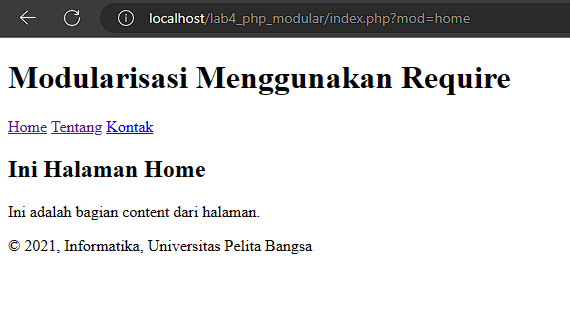

# PHP-Modular
# PHP-Dasar

This project is an assignment from my class
#### NIM : 312110103
#### Kelas : TI.21.A2
#### MatKul : Pemrograman Weh 2

### Latihan
## Membuat Routing
### Routing digunakan untuk mempermudah akses halaman web agar SEO Friendly

### Menggunakan HTACCESS

#### Hasil Htacces terlihat tidak ada ekstensi .php

### Menggunakan Praktikum 3 dengan Modular

